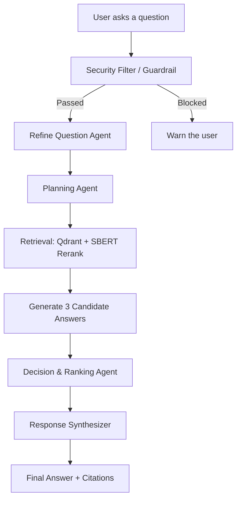

<div align="center">

# 🛡️ PDPA Chatbot — Agentic RAG

**An AI assistant that answers questions about Thailand's Personal Data Protection Act (PDPA) using a multi-agent Agentic RAG system**

🥈 **2nd Place — Best Senior Project Award**
BU ITI Empowering Day 2026, Bangkok University


</div>

<br/>

## 📖 About

**PDPA Chatbot** is an assistant that answers questions about Thailand's Personal Data Protection Act (PDPA). Instead of a simple retrieve-then-generate pipeline, it uses an **Agentic RAG** architecture — multiple specialized agents orchestrated with **LangGraph** to refine the question, plan the approach, retrieve evidence, generate several candidate answers, rank them, and synthesize a final answer with clear source citations.

The system can answer from a pre-built PDPA knowledge base or from a user-uploaded PDF in real time, including OCR support for Thai-language documents.

<br/>

## ✨ Key Features

- **Multi-agent pipeline (LangGraph)** — 6 stages: Refine Question → Planning → Retrieval → Generate Candidates → Decision & Ranking → Response Synthesis
- **Multiple scored candidate answers** — generates 3 candidate answers per question, then has an LLM judge rank them across 5 dimensions: relevance, completeness, accuracy, clarity, and legal citation
- **Retrieval + reranking** — retrieves from a Qdrant vector database, then reranks results with Sentence-BERT for precision
- **User document upload** — analyzes uploaded PDFs with Thai OCR (Typhoon OCR) and checks whether the document is actually PDPA-related
- **Security guardrail** — filters inappropriate or abusive input before it enters the pipeline
- **Persistent chat history in Qdrant** — keeps per-session conversation context for follow-up questions
- **Live agent progress + citations in the UI** — shows a real-time progress log and source references (file + page number) in the chat
- **RAGAS-based evaluation** — a 150-question test set for systematic answer-quality measurement

<br/>

## 🧠 Architecture (Agentic Workflow)



<br/>

## 🛠 Tech Stack

<table>
<tr>
<td valign="top" width="25%">

**🤖 LLM & Orchestration**

- LangGraph (state machine / multi-agent)
- Typhoon2.5-Qwen3-4B (GGUF, served via llama.cpp)
- OpenAI-compatible API client
- Instructor · LiteLLM

</td>
<td valign="top" width="25%">

**🔎 Retrieval & Data**

- Qdrant (Vector DB — knowledge base + chat history)
- Sentence-Transformers (multilingual embeddings + reranking)
- RAGAS (RAG evaluation)

</td>
<td valign="top" width="25%">

**📄 Document Processing**

- PyMuPDF · pdfplumber · pypdf
- Typhoon OCR (Thai-language OCR)
- PyThaiNLP (Thai NLP)

</td>
<td valign="top" width="25%">

**🖥 App & Safety**

- Streamlit (Chat UI)
- Guardrails-AI (custom security filter)
- Python-dotenv

</td>
</tr>
</table>

<br/>

## 📂 Project Structure

```
PDPA-CHATBOT-AGENTIC-RAG/
├── app_llama3.2.py           # Streamlit entry point
├── src/agentic_rag/
│   ├── crew.py                # LangGraph workflow (agent pipeline)
│   ├── config/                # agents.yaml, tasks.yaml
│   └── tools/                 # DocumentSearchTool, QdrantStorage, SecurityFilter, ChatHistoryStore
├── knowledge/                  # PDPA knowledge base (PDF)
├── eval/                       # RAGAS evaluation scripts
├── results150Questions/        # Results from the 150-question test set
├── assets/                     # Logo and media files
├── ingest_uploader.py          # Script to ingest documents into Qdrant
├── run.bat / llm.bat / llmgen.bat
└── requirements.txt
```

<br/>

## 🚀 Getting Started

**1. Clone the repository**

```bash
git clone https://github.com/KlaKrittin/PDPA-CHATBOT-AGENTIC-RAG.git
cd PDPA-CHATBOT-AGENTIC-RAG
```

**2. Create a virtual environment and install dependencies**

```bash
python -m venv venv
venv\Scripts\activate
pip install -r requirements.txt
```

**3. Configure the `.env` file**

```env
MODEL=your_model_name
OPENAI_API_KEY=your_openai_api_key
QDRANT_URL=          # endpoint from https://qdrant.tech/ (Account 1)
QDRANT_API_KEY=      # API key from Qdrant (Account 1)
QDRANT_URL2=         # endpoint from https://qdrant.tech/ (Account 2 - used for chat history)
QDRANT_API_KEY2=     # API key from Qdrant (Account 2)
TYPHOON_OCR_API_KEY= # API key from https://opentyphoon.ai/model/typhoon-ocr
RAG_EMBED_MODEL=sentence-transformers/paraphrase-multilingual-MiniLM-L12-v2
```

> ⚠️ Never commit a `.env` file containing real API keys to a public repository.

**4. Start the local LLM server (Typhoon2.5-Qwen3-4B via llama.cpp)**

```bash
llm.bat
```

**5. Ingest knowledge documents into Qdrant (first run only)**

```bash
python ingest_uploader.py
```

**6. Run the app**

```bash
run.bat
```

or directly with:

```bash
streamlit run app_llama3.2.py
```

<br/>

## 📊 Evaluation

The system was evaluated with the **RAGAS** framework on a **150-question** test set (`results150Questions/`), covering relevance, accuracy, and completeness of answers against the PDPA text.

<br/>

## 🏆 Award

**Best Senior Project Award (2nd Place)** — BU ITI Empowering Day 2026, Bangkok University

<br/>

## 👤 Author

**Krittin (KlaKrittin)** — Software Developer / AI Engineer
📧 krittin2131@gmail.com · [GitHub](https://github.com/KlaKrittin)
